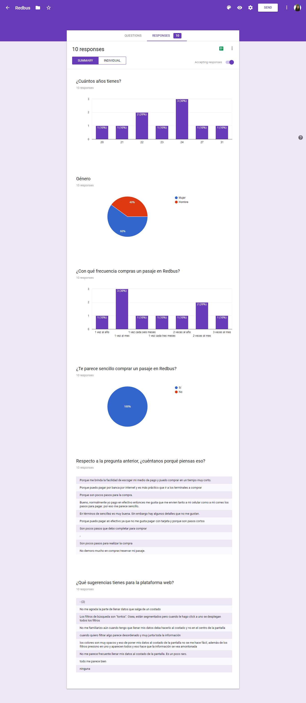
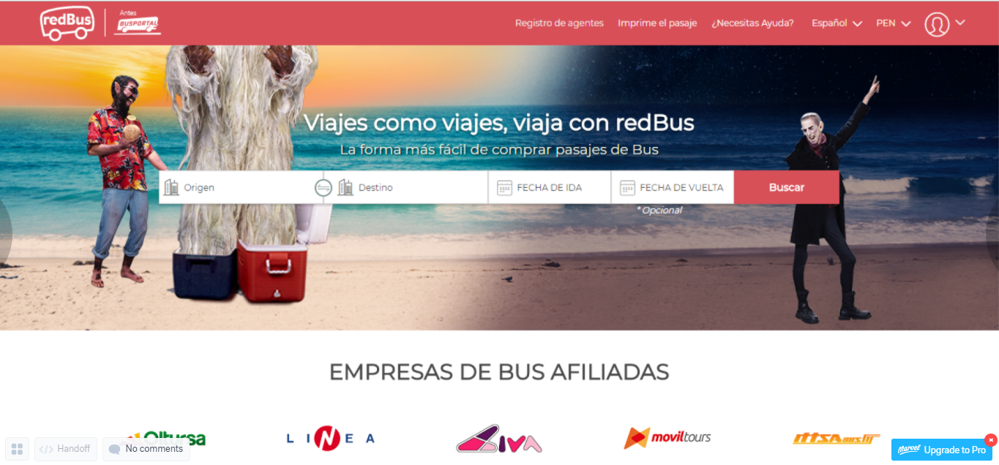

# RedBus

El reto:

    Maquetar y dar funcionalidad a una página responsiva de conrmación de
    la pasarela Pago Efectivo, la página brindara mayor conversión a las ventas
    realizadas en Pago Efectivo y Banca Online.

## Proceso UX:

Este proceso fue desarrollado por Rocio Quilla - UX Designer. En este proceso mostraremos una investigación y un prototipo de alta fidelidad el cual es una propuesta con resultados de la investigación; teniendo así adicionales a los pedidos en el reto.

Se realizó una encuesta virtual de la cual se obtuvo la siguiente información:

Algunos outputs de la encuesta fueron los siguientes:

* A los usuarios les parece sencillo realizar una compra de pasaje mediante RedBus.
* Les agrada tener una variedad para escoger su medio de pago; es decir; múltiples opciones de bancos.
* Algunas cosas por mejorar de la web fueron: el llenado de datos que no esté al costado, los filtros que dejen de ser grupales. 

Nuestro **User Persona** es una mujer de 24 años, que ya trabaja y que viaja como mínimo 1 vez al mes.

**Problem Statements**

El problema a resolver más allá del propuesto es hacer que los usuarios tengan una experiencia más completa cubriendo las sugerencias que nos dio la encuesta.

**HMV**

* ¿Cómo podríamos hacer que lo usuarios dejen de sentirse extraños al llenar los datos al costado?
* ¿Cómo podríamos hacer que los filtros dejen de ser grupales?
* ¿Cómo podríamos hacer que las instrucciones que se envían para imprimir sean más entendibles?

### Prototipo:

Se desarrolló el siguiente prototipo en alta fidelidad en la cual se cubren los requisitos del reto y se agregan adicionales que se observaron en la encuesta.

https://marvelapp.com/65i64hb

## Proceso Front-End:

Esta segunda parte del proceso fue desarrollada por Katherine Levano y Jessica Maturano, ambas Front Ends Developers. 

Ambas cubrieron los requisitos funcionales pedidos en el reto tal como se puede observar desplegado en gh-pages.

#### Herramientas:

* HTML5
* CSS3
* Javascript

## Desarrollado por:

* Katherine Levano -  Front End Developer.
* Jessica Maturano - Front End Developer.
* Rocio Quilla - User Experience Designer.